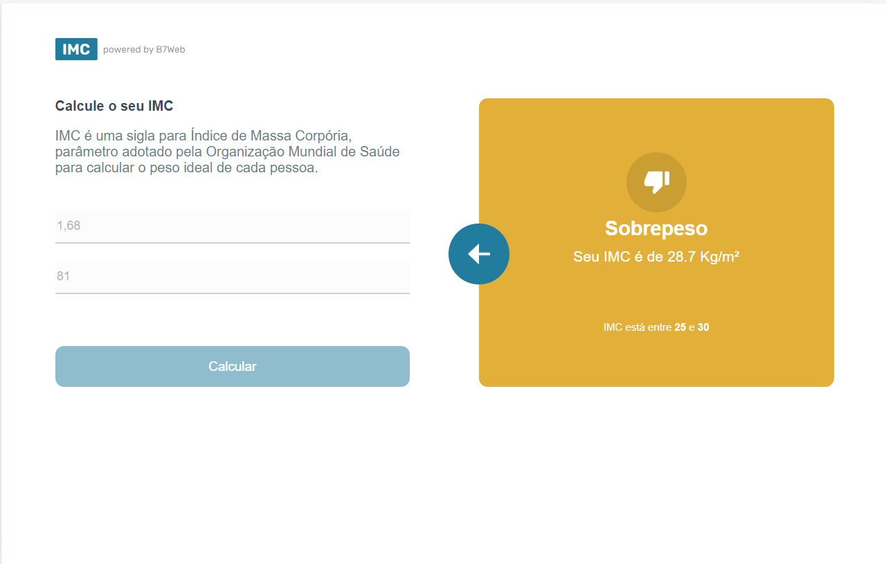
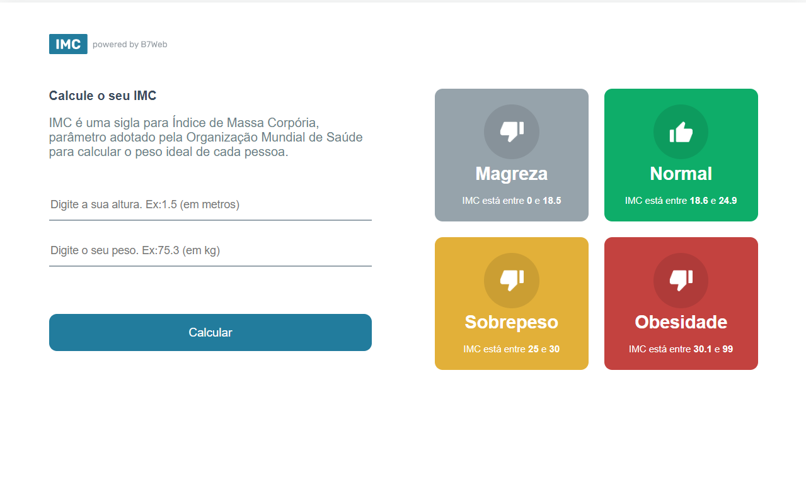
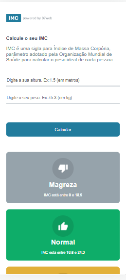
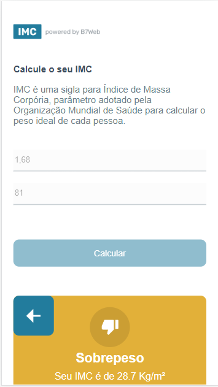

# Calculadora de IMC
Projeto em React + Typescript fazendo uma calculadora de IMC.

## Demostração em Desktop

## Demostração Mobile

### Instalação
- `npm install`
- `npm start`

## Créditos
Projeto desenvolvido durante o curso [B7Web](https://b7web.com.br)